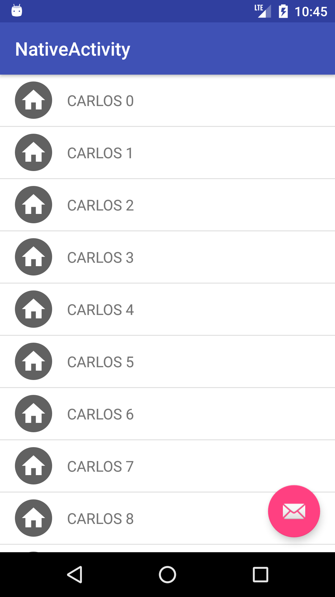
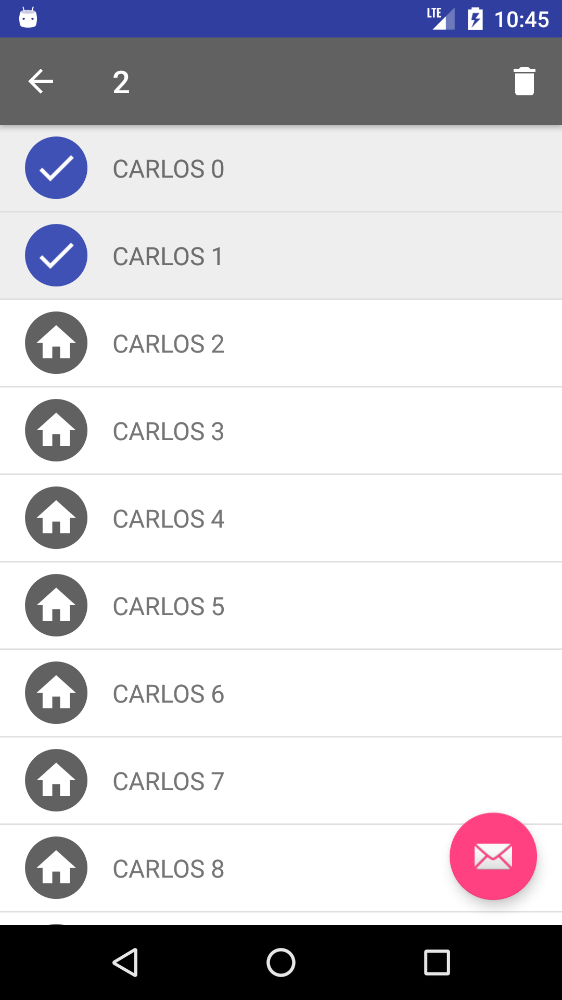

# Enabled Toolbar
This sample project demonstrates how to work with two toolbar, one of them in a enabled state
The selection of one toolbar happens once you select an item in the list.

    
    

